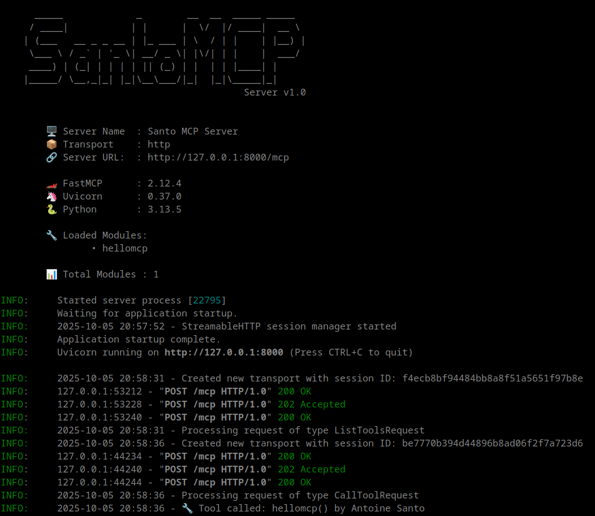

# SantoMcpServer
a tiny Mcp Server based on FastMCP with simple enable/disable module tools facilities.

## Installation
Nothing special, there is a little requirements.txt file with only fastmcp and uvicorn

## Screenshot
 

## Technical Informations
I use a NGINX server as a front ( to handle SSL and BEARER auth token process )
here is my config part if you need an example : 
```
location = /mcp {
    # Check if there is an Authorization in the header
    if ($http_authorization = "") {
        return 401;
    }

    # Check if it start by "Bearer "
    if ($http_authorization !~* "^Bearer ") {
        return 401;
    }

    # Check if it's the allowed static token ( Change for yours ;) )
    if ($http_authorization !~ "^Bearer THIS_IS_MY_TOKEN$") {
        return 401;
    }

    # jump to our server ;)
	  proxy_pass http://127.0.0.1:8000/mcp;
}
```
